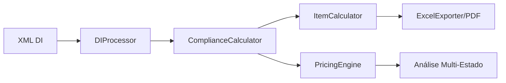

# Sistema de Importação e Precificação Expertzy

## 📋 Sobre o Projeto

Sistema brasileiro completo para processamento de Declarações de Importação (DI), cálculo automático de impostos e otimização de estratégias de precificação com incentivos fiscais estaduais.

### 🎯 Principais Funcionalidades

- **Processamento de XML de DI**: Extração automática de dados de Declarações de Importação
- **Cálculo de Impostos**: II, IPI, PIS, COFINS, ICMS com regras específicas por estado
- **Incentivos Fiscais**: Otimização automática para GO, SC, ES, MG
- **Exportação Múltipla**: Excel, PDF, JSON com formatação brasileira
- **Interface Web Moderna**: Sistema responsivo com duas interfaces especializadas

## 🚀 Começando

### Pré-requisitos

- Navegador web moderno (Chrome, Firefox, Edge)
- Servidor web local (opcional, pode abrir diretamente)

### Instalação

1. Clone o repositório:
```bash
git clone https://github.com/seu-usuario/importa-precifica.git
cd importa-precifica
```

2. Abra o sistema principal:
```bash
open sistema-expertzy-local/index.html
```

Ou acesse diretamente:
- **Processador DI**: `sistema-expertzy-local/di-processing/di-processor.html`
- **Sistema de Precificação**: `sistema-expertzy-local/pricing-strategy/pricing-system.html`

## 📁 Estrutura do Projeto

```
importa-precifica/
├── sistema-expertzy-local/          # Sistema web principal
│   ├── di-processing/               # Módulo de processamento DI
│   │   ├── di-processor.html        # Interface de conformidade
│   │   └── js/                      # Lógica de processamento
│   │       ├── DIProcessor.js       # Parser XML
│   │       ├── ComplianceCalculator.js # Motor de cálculos
│   │       └── ExcelExporter.js     # Exportação Excel
│   ├── pricing-strategy/            # Módulo de precificação
│   ├── shared/                      # Recursos compartilhados
│   │   ├── data/                    # Configurações JSON
│   │   │   ├── aliquotas.json      # Alíquotas por estado
│   │   │   └── beneficios.json     # Incentivos fiscais
│   │   └── js/                      # Módulos comuns
│   └── samples/                     # XMLs de exemplo
├── orientacoes/                     # Protótipo Python legado
└── relatorios/                      # Relatórios gerados
```

## 💼 Funcionalidades Detalhadas

### Processamento de DI
- Upload de XML via drag & drop
- Validação automática de estrutura
- Extração de múltiplas adições
- Cálculo de taxa de câmbio automático

### Cálculos de Impostos
- **II**: Imposto de Importação com alíquotas por NCM
- **IPI**: Sobre valor CIF + II
- **PIS/COFINS**: 11,75% combinado
- **ICMS**: Alíquotas estaduais com ST
- **Despesas**: SISCOMEX, AFRMM, capatazia

### Incentivos Fiscais por Estado
- **GO**: 67% crédito ICMS para NCMs específicos
- **SC**: 75% ICMS diferido (TTD 060)
- **ES**: Benefícios FUNDAP (taxa efetiva 9%)
- **MG**: Cálculo padrão

### Exportação de Dados
- **Excel**: Planilha completa com múltiplas abas
- **PDF**: Croqui para nota fiscal de entrada
- **JSON**: Dados estruturados para integração

## 🛠️ Tecnologias Utilizadas

- **Frontend**: HTML5, CSS3, JavaScript ES6+
- **Frameworks CSS**: Bootstrap 5
- **Bibliotecas**: 
  - SheetJS (manipulação Excel)
  - jsPDF (geração PDF)
  - Chart.js (gráficos)
- **Backend Legado**: Python 3 com Tkinter

## 📊 Fluxo de Dados



## 🔧 Configuração

### Alíquotas ICMS por NCM
1. Abrir o processador DI
2. Carregar uma DI
3. Clicar em "Configurar Alíquotas"
4. Definir alíquotas específicas por NCM

### Despesas Extras
- Armazenagem
- Transporte interno
- Despachante aduaneiro
- Outras despesas

## 📝 Formato XML Suportado

O sistema processa XMLs de DI no formato padrão da Receita Federal:
```xml
<declaracaoImportacao>
  <numeroDI>23/0012074-6</numeroDI>
  <adicao>
    <numeroAdicao>001</numeroAdicao>
    <ncm>8517.12.31</ncm>
    ...
  </adicao>
</declaracaoImportacao>
```

## 🐛 Problemas Conhecidos

- Requer navegador com suporte a ES6+
- XMLs muito grandes (>100 adições) podem demorar para processar
- Configurações ICMS não persistem entre sessões (usar localStorage)

## 🤝 Contribuindo

1. Fork o projeto
2. Crie sua feature branch (`git checkout -b feature/MinhaFeature`)
3. Commit suas mudanças (`git commit -m 'Add: Nova funcionalidade'`)
4. Push para a branch (`git push origin feature/MinhaFeature`)
5. Abra um Pull Request

## 📄 Licença

Este projeto é proprietário e confidencial. Todos os direitos reservados.

## 👥 Autores

- Sistema desenvolvido para Expertzy Consultoria
- Especializado em comércio exterior brasileiro

## 📞 Suporte

Para suporte, entre em contato através do sistema de issues do GitHub.

## 🚦 Status do Projeto

✅ **Fase 1 - Processamento DI**: Completo e funcional  
✅ **Fase 2 - Precificação**: Completo e funcional  
🔄 **Melhorias contínuas**: Em desenvolvimento

---

*Sistema otimizado para o mercado brasileiro de importação com foco em conformidade fiscal e otimização tributária.*