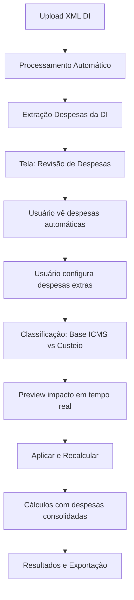

# Plano de Implementação: Sistema de Despesas Extras na Importação

## Contexto e Necessidade

Atualmente o sistema processa automaticamente o XML da DI e calcula ICMS baseado apenas nas despesas aduaneiras extraídas (SISCOMEX, AFRMM, capatazia). No entanto, na prática da importação, existem despesas adicionais que devem ser consideradas na base de cálculo do ICMS conforme a legislação tributária brasileira.

### Problema Atual
- Sistema processa DI automaticamente
- Não considera despesas extras que afetam base ICMS
- Usuário informa custos extras apenas para precificação
- Cálculo tributário fica incompleto/incorreto

### Solução Proposta
Implementar fluxo que permita ao usuário:
1. Visualizar despesas automáticas da DI
2. Adicionar despesas extras
3. Classificar despesas como tributáveis (base ICMS) ou apenas custeio
4. Recalcular tributação com base completa

## Análise do Sistema Atual

### Arquivos Principais
- **XMLParser.js**: Extrai despesas aduaneiras da DI automaticamente
- **Calculator.js**: Calcula base ICMS com despesas disponíveis
- **App.js**: Coordena fluxo e processamento
- **sistema-importacao.html**: Interface com formulário de custos extras
- **Storage.js**: Persiste dados de custos extras

### Pontos Fortes Identificados
✅ Base sólida de extração de despesas da DI
✅ Sistema de cálculo tributário estruturado
✅ Interface já existente para custos extras  
✅ Sistema de storage para persistência
✅ Rateios proporcionais implementados

## Implementação Detalhada

### Fase 1: XMLParser - Consolidação de Despesas

**Arquivo**: `js/xmlParser.js`

**Modificações**:
```javascript
// Novo método para consolidar todas as despesas
consolidarDespesasCompletas(despesasExtras = {}) {
    const despesasAutomaticas = this.extractDespesasAduaneiras();
    const despesasConsolidadas = {
        // Despesas da DI (automáticas)
        siscomex: despesasAutomaticas.siscomex || 0,
        afrmm: despesasAutomaticas.afrmm || 0,
        capatazia: despesasAutomaticas.capatazia || 0,
        
        // Despesas extras (manuais)
        armazenagem: despesasExtras.armazenagem || 0,
        transporte_interno: despesasExtras.transporte_interno || 0,
        despachante: despesasExtras.despachante || 0,
        outros_portuarios: despesasExtras.outros_portuarios || 0,
        
        // Classificação tributária
        tributaveis: {
            // Despesas que integram base ICMS
            total: 0, // Calculado dinamicamente
            detalhes: {}
        },
        custeio_apenas: {
            // Despesas apenas para precificação
            total: 0,
            detalhes: {}
        }
    };
    
    return despesasConsolidadas;
}
```

### Fase 2: Interface - Tela de Revisão de Despesas

**Arquivo**: `sistema-importacao.html`

**Nova seção após upload da DI**:
```html
<!-- Seção de Revisão de Despesas -->
<div id="despesas-review-section" class="section hidden">
    <h3>Revisão de Despesas de Importação</h3>
    
    <!-- Despesas encontradas automaticamente na DI -->
    <div class="subsection">
        <h4>Despesas Encontradas na DI</h4>
        <div id="despesas-automaticas" class="readonly-section">
            <!-- Preenchido dinamicamente -->
        </div>
    </div>
    
    <!-- Despesas extras a configurar -->
    <div class="subsection">
        <h4>Despesas Extras</h4>
        <form id="despesas-extras-form">
            <div class="expense-row">
                <label>Armazenagem:</label>
                <input type="number" id="armazenagem" step="0.01">
                <input type="checkbox" id="armazenagem-tributavel"> Base ICMS
            </div>
            <div class="expense-row">
                <label>Transporte Interno:</label>
                <input type="number" id="transporte-interno" step="0.01">
                <input type="checkbox" id="transporte-tributavel"> Base ICMS
            </div>
            <div class="expense-row">
                <label>Despachante:</label>
                <input type="number" id="despachante" step="0.01">
                <input type="checkbox" id="despachante-tributavel"> Base ICMS
            </div>
            <!-- Mais campos conforme necessário -->
        </form>
    </div>
    
    <!-- Preview do impacto -->
    <div class="subsection">
        <h4>Impacto nos Cálculos</h4>
        <div id="preview-impacto">
            <p>Base ICMS atual: R$ <span id="base-icms-atual">0,00</span></p>
            <p>Base ICMS com despesas: R$ <span id="base-icms-nova">0,00</span></p>
            <p>ICMS adicional: R$ <span id="icms-adicional">0,00</span></p>
        </div>
    </div>
    
    <button id="aplicar-despesas" class="btn btn-primary">
        Aplicar Despesas e Recalcular
    </button>
</div>
```

### Fase 3: App.js - Novo Fluxo UX

**Arquivo**: `js/app.js`

**Modificações no fluxo principal**:
```javascript
// Após processamento da DI, mostrar revisão de despesas
async processXMLFile(file) {
    try {
        // Processamento atual...
        const diData = await this.xmlParser.parseDI(xmlContent);
        
        // NOVO: Exibir tela de revisão de despesas
        this.showDespesasReview(diData);
        
    } catch (error) {
        console.error('Erro no processamento:', error);
    }
}

// Nova função para exibir revisão
showDespesasReview(diData) {
    // Extrair despesas automáticas da DI
    const despesasAutomaticas = diData.despesas_aduaneiras;
    
    // Exibir despesas encontradas
    this.displayDespesasAutomaticas(despesasAutomaticas);
    
    // Mostrar seção de revisão
    document.getElementById('despesas-review-section').classList.remove('hidden');
    
    // Configurar listeners para preview em tempo real
    this.setupDespesasPreview();
}

// Preview em tempo real do impacto
setupDespesasPreview() {
    const inputs = document.querySelectorAll('#despesas-extras-form input');
    inputs.forEach(input => {
        input.addEventListener('input', () => this.updateDespesasPreview());
        input.addEventListener('change', () => this.updateDespesasPreview());
    });
}

updateDespesasPreview() {
    const despesasExtras = this.collectDespesasExtras();
    const impacto = this.calculator.previewImpactoDespesas(despesasExtras);
    
    document.getElementById('base-icms-atual').textContent = 
        this.formatCurrency(impacto.baseAtual);
    document.getElementById('base-icms-nova').textContent = 
        this.formatCurrency(impacto.baseNova);
    document.getElementById('icms-adicional').textContent = 
        this.formatCurrency(impacto.icmsAdicional);
}
```

### Fase 4: Calculator.js - Despesas Consolidadas

**Arquivo**: `js/calculator.js`

**Modificações nos cálculos**:
```javascript
// Modificar cálculo da base ICMS para usar despesas consolidadas
calculateBaseICMS(adicao, despesasConsolidadas = null) {
    let baseAntesICMS = adicao.valor_reais || 0;
    
    // Tributos existentes
    baseAntesICMS += adicao.tributos?.ii_valor_devido || 0;
    baseAntesICMS += adicao.tributos?.ipi_valor_devido || 0;
    baseAntesICMS += adicao.tributos?.pis_valor_devido || 0;
    baseAntesICMS += adicao.tributos?.cofins_valor_devido || 0;
    
    // Despesas aduaneiras automáticas (existente)
    baseAntesICMS += adicao.despesas_aduaneiras?.total || 0;
    
    // NOVO: Despesas extras tributáveis
    if (despesasConsolidadas?.tributaveis) {
        baseAntesICMS += despesasConsolidadas.tributaveis.total;
    }
    
    // Aplicar fórmula "por dentro"
    const aliquotaICMS = this.getAliquotaICMS();
    const fatorDivisao = 1 - (aliquotaICMS / 100);
    const baseICMS = baseAntesICMS / fatorDivisao;
    
    return baseICMS;
}

// Novo método para preview de impacto
previewImpactoDespesas(despesasExtras) {
    const baseAtual = this.calculateBaseICMS(this.currentAdicao);
    const despesasConsolidadas = this.consolidarDespesas(despesasExtras);
    const baseNova = this.calculateBaseICMS(this.currentAdicao, despesasConsolidadas);
    
    const aliquotaICMS = this.getAliquotaICMS();
    const icmsAtual = baseAtual * (aliquotaICMS / 100);
    const icmsNovo = baseNova * (aliquotaICMS / 100);
    
    return {
        baseAtual,
        baseNova,
        icmsAdicional: icmsNovo - icmsAtual
    };
}
```

### Fase 5: Storage.js - Persistência Melhorada

**Arquivo**: `js/storage.js`

**Nova funcionalidade**:
```javascript
// Salvar configuração completa de despesas por DI
saveDespesasConsolidadas(diNumero, despesasConfig) {
    const key = `despesas_consolidadas_${diNumero}`;
    const data = {
        di_numero: diNumero,
        timestamp: new Date().toISOString(),
        despesas_automaticas: despesasConfig.automaticas,
        despesas_extras: despesasConfig.extras,
        classificacao_tributaria: despesasConfig.classificacao,
        total_tributavel: despesasConfig.totalTributavel,
        total_custeio: despesasConfig.totalCusteio
    };
    
    localStorage.setItem(key, JSON.stringify(data));
    
    // Manter histórico
    this.addToHistorico('despesas_configuradas', data);
}

// Recuperar configuração de despesas
getDespesasConsolidadas(diNumero) {
    const key = `despesas_consolidadas_${diNumero}`;
    const stored = localStorage.getItem(key);
    return stored ? JSON.parse(stored) : null;
}
```

## Fluxo Final Implementado



## Benefícios da Implementação

### Técnicos
✅ **Compatibilidade**: Sistema atual continua funcionando  
✅ **Modularidade**: Cada arquivo tem responsabilidade clara  
✅ **Extensibilidade**: Fácil adicionar novos tipos de despesas  
✅ **Performance**: Cálculos otimizados com cache  

### Funcionais  
✅ **Precisão tributária**: Base ICMS correta com todas as despesas  
✅ **Transparência**: Usuário vê impacto de cada decisão  
✅ **Flexibilidade**: Pode escolher quais despesas são tributáveis  
✅ **Auditoria**: Histórico de configurações salvas  

### UX/UI
✅ **Intuitividade**: Fluxo guiado e claro  
✅ **Feedback**: Preview em tempo real  
✅ **Controle**: Usuário decide classificação das despesas  
✅ **Eficiência**: Processo otimizado sem retrabalho  

## Cronograma Estimado

- **Fase 1** (XMLParser): 1 dia
- **Fase 2** (Interface): 2 dias  
- **Fase 3** (App.js): 2 dias
- **Fase 4** (Calculator): 1 dia
- **Fase 5** (Storage): 1 dia
- **Testes e Ajustes**: 1 dia

**Total**: 8 dias de desenvolvimento

## Riscos e Mitigações

**Risco**: Quebrar funcionalidades existentes  
**Mitigação**: Implementação incremental com fallbacks

**Risco**: Performance com muitas despesas  
**Mitigação**: Cache de cálculos e otimizações

**Risco**: Complexidade para o usuário  
**Mitigação**: Interface intuitiva com ajuda contextual

---

**Documento criado em**: 2025-08-27  
**Versão**: 1.0  
**Status**: Pronto para implementação